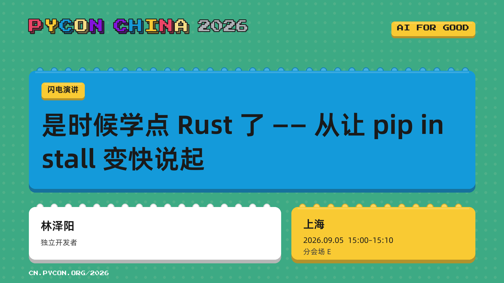
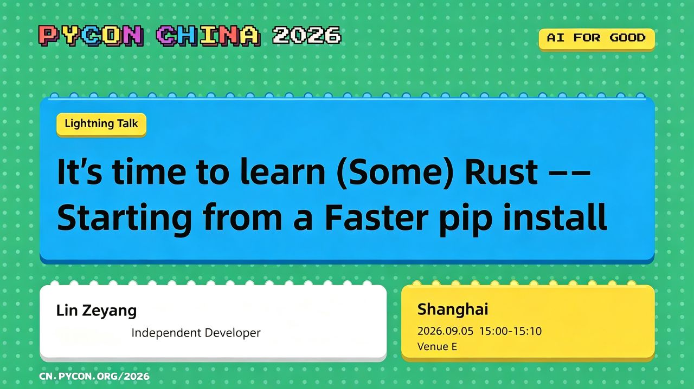

本仓库是 PyCon China 2026 上海站闪电演讲《是时候学点 Rust 了 —— 从 pip install 变快说起》的配套仓库，收录演讲幻灯片、演示示例代码及相关素材。

本仓库结构为：

```text
.
├── README.md                # 本文件（演讲简介，中英双语）
├── slides.pdf               # 演讲幻灯片
├── assets/                  # 幻灯片使用的图片素材（截图、图标等）
├── code/                    # 演示示例代码
│   ├── fibonacci_rs/        # PyO3 + maturin 最小示例：Fibonacci
│   ├── julia_set_rs/        # Julia 集计算：纯 Python 基线 vs Rust 扩展
│   └── julia_set_pure_rust/ # （额外内容）纯 Rust + rayon 并行实现，与 julia_set_rs 的纯 Python 基线、Rust 扩展构成三方对比
└── LICENSE
```

[](https://cn.pycon.org/2026/talks/learn-rust-faster-pip-install/)

[https://cn.pycon.org/2026/talks/learn-rust-faster-pip-install/](https://cn.pycon.org/2026/talks/learn-rust-faster-pip-install/)

## 是时候学点 Rust 了 —— 从 pip install 变快说起

你可能已经在天天使用 Rust 了：uv、ruff、polars 的背后都是它，pydantic v2 用 Rust 重写校验核心后快了 17 倍。更值得关注的是，Rust for CPython 工作组已确认以 Python 3.16 为目标，计划以 `zlib-rs` 实验性重写 zlib 模块，相关 PEP 预计于今夏提交社区讨论 —— 如果落地，你的每一次 `pip install` 解压都会因此变快。Rust 不是 Python 的对手，而是它的伙伴：Python 负责编排，Rust 负责速度与安全。

本次闪电演讲基于我作为 Python 开发者自学 Rust 的真实经历，在 10 分钟内分享三件事：

1. **为什么值得学**：即使永远不写生产级 Rust，所有权、显式错误处理、穷尽匹配这些思维习惯也会迁移回来，让你写出更严谨的 Python（在 free-threading 时代，这种并发安全直觉尤为珍贵）；
2. **落地实战**：用 PyO3 + maturin 把一个真实的 CPU 密集热点函数改写为 Rust 扩展 —— Python 侧只改一行 import，测试原样通过，附前后性能与内存实测对比，以及“哪些代码值得改、哪些不值得”的决策清单；
3. **一个月路线图**：从 EAFP 到 LBYL 的思维转换难点在哪里、如何跨过借用检查器这道坎，以及基于微软开源课程《Rust for Python Programmers》与官方 Rust Book 的四周学习计划。

听众不需要任何 Rust 基础。你将带走一份可立即上手的学习路线、一套热点函数迁移的操作步骤，以及一个判断“该不该用 Rust”的决策框架。

---

This repository accompanies the PyCon China 2026 (Shanghai) lightning talk _It's time to learn (Some) Rust -- Starting from a Faster pip install_. It contains the slides, the demo projects, and related assets.

The repository structure is as follows:

```text
.
├── README.md                # This file (talk description, bilingual)
├── slides.pdf               # Talk slides
├── assets/                  # Images used by the slides (screenshots, icons, etc.)
├── code/                    # Demo projects
│   ├── fibonacci_rs/        # Minimal PyO3 + maturin example: Fibonacci
│   ├── julia_set_rs/        # Julia-set calculator: pure-Python baseline vs. Rust extension
│   └── julia_set_pure_rust/ # (Bonus content) Pure-Rust (rayon-parallel) implementation for a three-way comparison
└── LICENSE
```

[](https://cn.pycon.org/2026/talks/learn-rust-faster-pip-install/)

[https://cn.pycon.org/2026/talks/learn-rust-faster-pip-install/](https://cn.pycon.org/2026/talks/learn-rust-faster-pip-install/)

## It's time to learn (Some) Rust -- Starting from a Faster pip install

You are probably using Rust every day already: uv, ruff, and polars are all powered by it, and pydantic v2 became 17x faster after rewriting its validation core in Rust. Even more worth noting, the Rust for CPython working group has confirmed Python 3.16 as the target for experimentally rewriting the zlib module with `zlib-rs`, with the PEP expected to be submitted for community discussion this summer — if it lands, every `pip install` you run will get faster. Rust is not Python's rival but its partner: Python for orchestration, Rust for speed and safety.

Based on my real experience of learning Rust as a Python developer, this 10-minute lightning talk covers three things:

1. **Why it's worth learning**: even if you never ship production Rust, the mental habits it trains — ownership, explicit error handling, exhaustive matching — transfer back and make your Python more rigorous (a concurrency-safety instinct that matters even more in the free-threading era);
2. **Hands-on practice**: a walkthrough of rewriting a real CPU-bound hot function as a Rust extension with PyO3 + maturin — only one import line changes on the Python side, all tests pass unchanged, with before/after benchmarks of speed and memory, plus a decision checklist for what is (and isn't) worth migrating;
3. **A one-month roadmap**: where the EAFP-to-LBYL mindset shift hurts, how to get past the borrow checker, and a four-week learning plan built on Microsoft's open course _Rust for Python Programmers_ and the official Rust Book.

No Rust background required. You will walk away with a ready-to-use learning path, a step-by-step recipe for migrating hot functions, and a decision framework for judging when Rust is the right tool.
